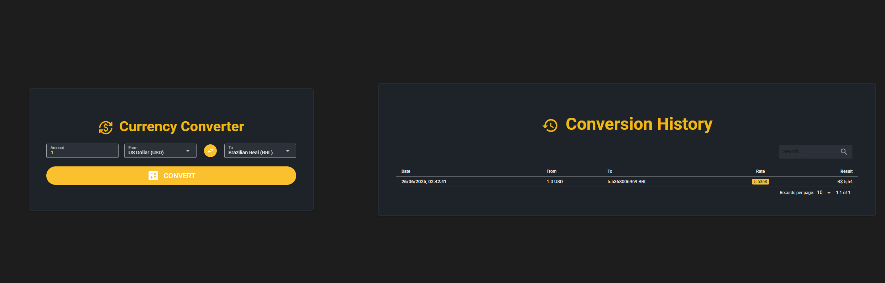

## 🛠️ Passo a Passo para Build do Projeto Quasar

### Pré-requisitos
1. Node.js instalado (versão 18 ou superior)
2. Yarn ou npm instalado
3. Quasar CLI instalado globalmente

### Instalação
1. Navegue até o diretório do projeto:
   ```bash
   cd currency-converter-frontend
   ```
2. Instale as dependências:
   ```bash
   yarn install
   # ou
   npm install
   ```

### Configuração
1. Crie um arquivo `.env` na raiz do projeto com as seguintes variáveis:
   ```env
   VITE_WEB_BASE_URL=http://localhost:3000/
   VITE_API_BASE_URL=http://localhost:3000/api/v1/
   ```

### Executando o Projeto
1. Para rodar o projeto em modo de desenvolvimento:
   ```bash
   quasar dev
   ```
2. O projeto estará disponível em:
   ```bash
   http://localhost:9000
   ```

### Linting e Formatação
1. Para verificar problemas de código:
   ```bash
   yarn lint
   ```
2. Para formatar o código automaticamente:
   ```bash
   yarn format
   ```


   ### 📸 Preview da Aplicação

   

   *Tela principal mostrando:*
   - Conversor de moedas
   - Histórico de transações
